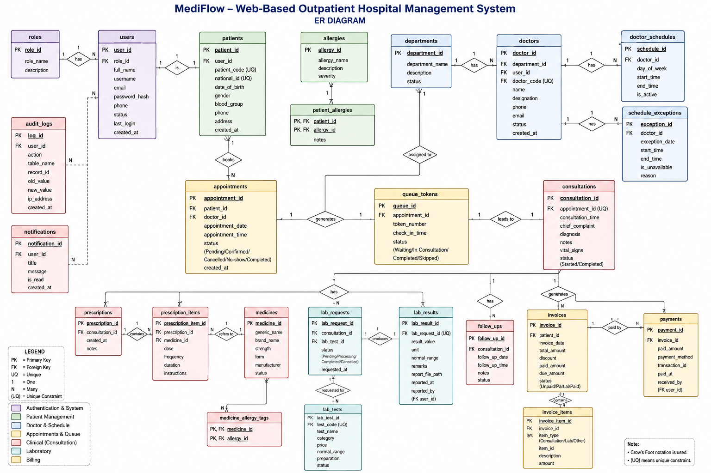

# 🚀 MediFlow --- Web-Based Outpatient Hospital Management System

------------------------------------------------------------------------

## 📌 Overview

**MediFlow** is a web-based outpatient hospital management system
designed to streamline patient registration, appointments,
consultations, laboratory services, prescriptions, billing, and
administrative operations.

It provides role-based access for different hospital users while keeping
healthcare information organized through a centralized relational
database.

------------------------------------------------------------------------

## 👥 Group Details

-   **Group Number:** 2
-   **Course Name:** Database Management System
-   **Course Code:** CSE 224
-   **Instructor:** MD. Fahmidur Rahman Sakib

### 🧑‍🤝‍🧑 Team Members

  -------------------------------------------------------------------------------
  Name                  ID            Contribution
  --------------------- ------------- -------------------------------------------
  Rubaiya Rahman Akhi   242-115-303   Project coordination, frontend 
                                      development, backend 
                                      development, Admin module, 
                                      system integration and 
                                      documentation 

  Tonnoy Datta Bishal   242-115-331   Backend development, Database 
                                      design, ER diagram, 
                                      normalization, SQL queries and 
                                      database integration

  Debapratim Deb        242-115-313   Backend development, 
                                      authentication, role-based access 
                                      control and appointment/queue 
                                      workflow 

  Umme Habiba Nuha      242-115-311  Backend development, Patient, 
                                     Doctor and Laboratory modules, 
                                     UI/UX, testing and documentation 
  -------------------------------------------------------------------------------

------------------------------------------------------------------------

## 🎯 Objective

The objective of MediFlow is to provide a centralized system for
managing outpatient hospital activities.

The system reduces manual work by connecting patient management, doctor
schedules, appointments, consultations, laboratory requests,
prescriptions, invoices, payments, and administrative functions in one
database-driven application.

It also uses role-based access control so that users can access only the
features appropriate to their roles.

------------------------------------------------------------------------

## ✨ Features

### 👤 Patient Management

-   ✅ Patient self-registration
-   ✅ Patient profile management
-   ✅ Patient code generation
-   ✅ Patient appointment booking
-   ✅ Appointment history
-   ✅ Allergy information
-   ✅ Prescription and laboratory result access
-   ✅ Invoice and payment information

### 👨‍⚕️ Doctor Management

-   ✅ Doctor profiles
-   ✅ Department assignment
-   ✅ Doctor schedules
-   ✅ Schedule exceptions
-   ✅ Appointment management
-   ✅ Patient queue management
-   ✅ Consultation records
-   ✅ Diagnosis and clinical notes
-   ✅ Prescription creation
-   ✅ Laboratory request creation
-   ✅ Follow-up management

### 🧪 Laboratory Management

-   ✅ Laboratory test catalogue
-   ✅ Laboratory requests
-   ✅ Requested test items
-   ✅ Test results
-   ✅ Laboratory request status tracking

### 💳 Billing & Payment

-   ✅ Invoice generation
-   ✅ Invoice items
-   ✅ Discounts
-   ✅ Paid and due amounts
-   ✅ Payment recording
-   ✅ Payment methods
-   ✅ Outstanding invoice tracking

### 🛠️ Administrator Features

-   ✅ Dashboard with system statistics
-   ✅ User management
-   ✅ Patient management
-   ✅ Doctor management
-   ✅ Department management
-   ✅ Appointment management
-   ✅ Laboratory test management
-   ✅ Medicine management
-   ✅ Allergy management
-   ✅ Invoice and payment management
-   ✅ Notifications
-   ✅ Audit logs
-   ✅ System settings
-   ✅ Role-based access control

### 🔐 Security & Database Features

-   ✅ User authentication
-   ✅ Role-based authorization
-   ✅ Password hashing
-   ✅ PDO prepared statements
-   ✅ SQL injection protection
-   ✅ Foreign-key relationships
-   ✅ Database transactions
-   ✅ Audit logging

------------------------------------------------------------------------

## 🖼️ Project Preview

### 🔹 UI Screenshots

## 🖼️ Project Preview

.png)
.png)
.png)
.png)
.png)
.png)
.png)
.png)
.png)
.png)
.png)
.png)
.png)
.png)
.png)
.png)
.png)
.png)
.png)
.png)
.png)
.png)
.png)
.png)
.png)

### 🔹 ER Diagram



The database contains entities for users, roles, patients, departments,
doctors, appointments, consultations, prescriptions, medicines,
allergies, laboratory requests, invoices, payments, notifications, audit
logs, and other supporting modules.

------------------------------------------------------------------------

## 🏗️ Tech Stack

### **Frontend**

**HTML5, CSS3 and Vanilla JavaScript**

HTML5 is used to structure the web pages, CSS3 is used for styling and
responsive layouts, and Vanilla JavaScript is used for client-side
interactivity and validation.

### **Backend**

**PHP**

PHP handles the server-side application logic, authentication,
authorization, form processing, business rules, and communication with
the database.

**PDO (PHP Data Objects)** is used to connect PHP with MySQL/MariaDB and
execute prepared SQL statements.

### **Database**

**MySQL / MariaDB**

The system uses a relational database to store and manage structured
hospital data.

The database uses:

-   Primary keys
-   Foreign keys
-   Unique constraints
-   One-to-one relationships
-   One-to-many relationships
-   Many-to-many relationships through junction tables
-   Database views
-   Transactions
-   SQL CRUD operations

Important query operations include:

-   `SELECT`
-   `INSERT`
-   `UPDATE`
-   `DELETE`
-   `JOIN`
-   `WHERE`
-   `COUNT()`
-   `SUM()`
-   `GROUP BY`
-   `ORDER BY`

The project also includes database views for today's appointments,
outstanding invoices, and the doctor's daily queue.

### **Development Environment**

**XAMPP**

XAMPP is used as the local development environment. Apache runs the PHP
application, while MySQL/MariaDB provides the database server.
phpMyAdmin is used to manage and inspect the database during
development.

------------------------------------------------------------------------

## ⚙️ Installation & Setup

### 1. Install XAMPP

Install XAMPP with Apache and MySQL/MariaDB.

### 2. Start the Services

Open the XAMPP Control Panel and start:

``` text
Apache
MySQL
```

### 3. Place the Project

Copy the MediFlow project folder into:

``` text
xampp/htdocs/
```

For example:

``` text
xampp/htdocs/mediflow/
```

### 4. Create the Database

Open phpMyAdmin and create/import the MediFlow database and its SQL
structure.

### 5. Configure Database Connection

Update the project's database configuration with the correct:

``` text
Host
Database name
Username
Password
Port
```

If MySQL is configured on a non-default port, such as `3307`, the
project database connection must use that port.

### 6. Run MediFlow

Open the project through Apache:

``` text
http://localhost/mediflow/
```

------------------------------------------------------------------------

## 🗂️ Project Structure

``` text
/mediflow
│
├── index.php
├── setup.php
│
├── assets/
│   ├── css/
│   ├── js/
│   └── images/
│
├── includes/
│   ├── database/
│   ├── authentication/
│   └── common/
│
├── admin/
├── patient/
├── doctor/
├── laboratory/
├── billing/
│
├── database/
│   └── SQL files
│
├── ER-diagram/
│   └── ER diagram
│
└── README.md
```

> **Note:** Update the folder names above if your actual repository
> structure is different.

------------------------------------------------------------------------

## 🗄️ Database Design

MediFlow uses a relational database with separate tables for major
entities and modules.

Some of the main entities include:

``` text
Roles
Users
Patients
Doctors
Departments
Appointments
Doctor Schedules
Schedule Exceptions
Queue Tokens
Consultations
Prescriptions
Prescription Items
Medicines
Allergies
Laboratory Tests
Laboratory Requests
Laboratory Request Items
Invoices
Invoice Items
Payments
Notifications
Audit Logs
```

Many-to-many relationships are handled using junction tables such as:

``` text
patient_allergies
medicine_allergy_tags
```

The system also uses foreign keys to maintain referential integrity
between related records.

------------------------------------------------------------------------

## 🔄 Main System Flow

``` text
Patient Registration
        ↓
Patient Login
        ↓
Book Appointment
        ↓
Doctor Schedule / Availability
        ↓
Appointment Confirmation
        ↓
Check-in / Queue
        ↓
Doctor Consultation
        ↓
 ┌──────┼───────────┐
 ↓      ↓           ↓
Prescription   Laboratory   Follow-up
 ↓             Request
Medicine       ↓
Items          Results
 └──────┬───────────┘
        ↓
     Invoice
        ↓
     Payment
```

------------------------------------------------------------------------

## 🔐 Security

MediFlow uses several security mechanisms:

-   Password hashing for stored passwords
-   Role-based access control
-   Server-side authorization
-   PDO prepared statements
-   Input validation
-   Session-based authentication
-   Audit logging
-   Foreign-key constraints
-   Transactions for multi-step database operations

Prepared statements keep user-provided values separate from SQL
structure and help protect the application against SQL injection.

------------------------------------------------------------------------

## 🎥 Demo Video

👉 [Watch Project Demo](#)

[](https://drive.google.com/file/d/1gPYf4EnNcAVatTSw6qjdvjoBxTEs3Yew/view?usp=drive_link)

------------------------------------------------------------------------

## 📚 Course Information

**Course:** Database Management System\
**Course Code:** CSE 224\
**Department:** Computer Science & Engineering\
**University:** Metropolitan University\
**Batch:** CSE 61\
**Section:** G
